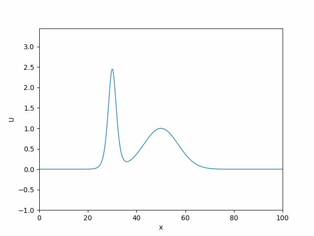
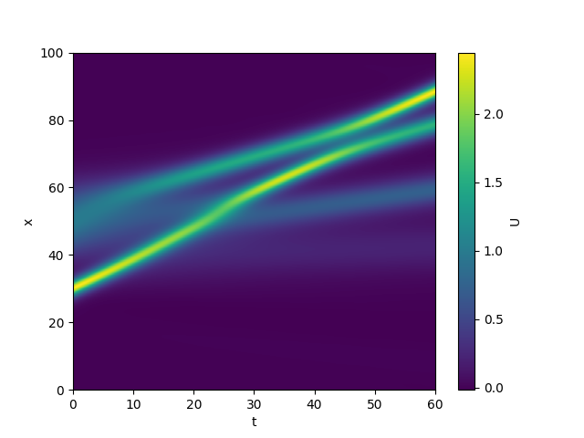
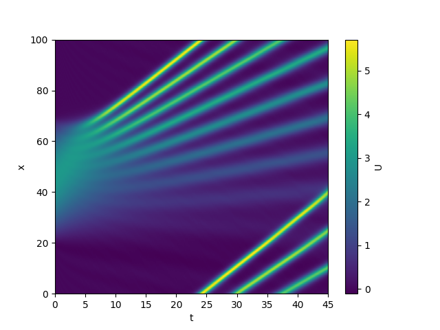
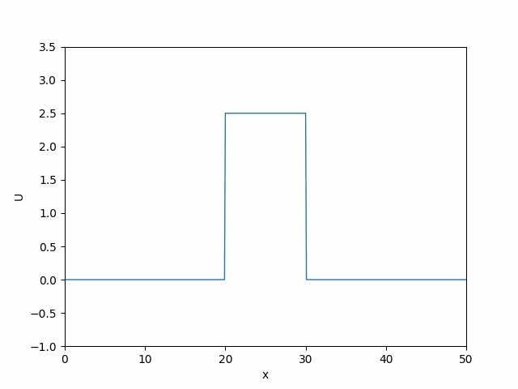
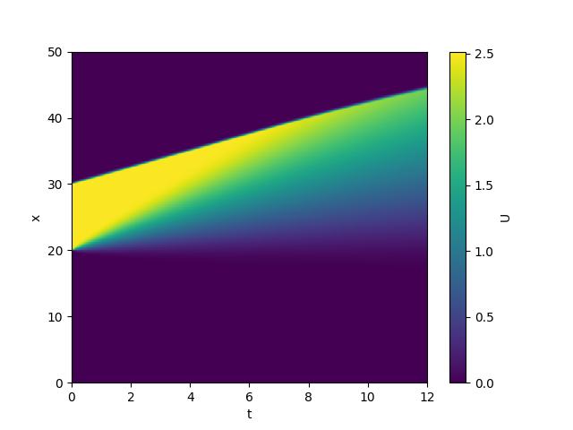

# Investigating Solitons and other Non-linear Wave Dynamics - Computational Physics Final Project
This repo contains my final project for Imperial's computational physics course. The project involved creating stable numerical methods that could solve the KDV and the Burgers' equations, both are complex non-linear PDEs, and then use these methods to investigating the properties of the equations and their solution, particularly soliton based solutions. Additionally, some analysis of the method's stability was performed.
For more info please read my summary/report `Non-linear waves.pdf`.

## Implementation and running
The numerical method uses a central difference scheme for all spacial derivatives and an RK4 method for solving temporal derivatives as it was found to offer great stability.
The code is designed using an OOP paradigm where a solver class is defined that takes in an initial condition (which are supplied as a well defined function over the simulation's spatial coordinates) and other parameters for the numerical solution. This solver class has a `.propagate()` function that will numerically solve the equation from the initial conditions over the time period specified. The spatial solutions at each time step are stored in an array for later analysis.
The code is written in Python 2.6 and uses NumPy for calculation and Matplotlib for all plots and animations.

## Files
`Non-linear_wave_dynamics.pdf`:  My project summary report.
`KDV_solver_and_stability.py`: Module containing KDV equation solver method and stability analysis.
`KDV_analysis.py`: script to solve KDV equation and analysis solutions.
`shockwave_solver.py`: Module containing Burgers' equation solver.
`shockwave_analysis.py`: Script to solve Burgers' equation and analysis solutions.
`plots`: Contains some plots from the project.
`requirements.txt`: Python requirements file.

## An example solution to KDV equation and its dynamics
||
|:---:|
| *Animation of an initial gaussian solution breaking into 2 solitons and a larger 1-soliton interacting with them.*|

||
|:---:|
|*Space-time plot showing the above animation.*|

||
|:---:|
|*Animation of an initial half sin wave breaking into an N-soliton solution.*|

||
|:----:|
|*Space-time plot showing N-soliton solution.*|

||
|:---:|
|*Animation of a square wave evolving under the diffusive Burgers' equation.*|

||
|:----:|
|*Space-time plot for square wave evolution.*|

